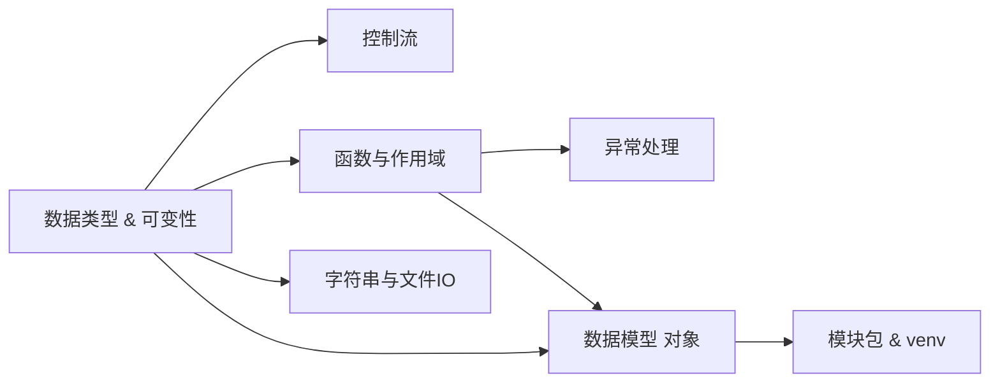

# 基础层｜语言巩固｜学习总览

<参考资料>

- https://docs.python.org/3/tutorial/index.html
- https://docs.python.org/3/reference/datamodel.html
- https://docs.python.org/3/reference/import.html

</参考资料>

## 本地知识库索引（模块级）

- `obsidian-vault/LLM_Learning/wiki/topics/python-fundamentals.md`
- `obsidian-vault/LLM_Learning/wiki/topics/python-data-model.md`
- `obsidian-vault/LLM_Learning/wiki/topics/python-module-system.md`
- `obsidian-vault/LLM_Learning/wiki/concepts/data-types.md`
- `obsidian-vault/LLM_Learning/wiki/concepts/control-flow.md`
- `obsidian-vault/LLM_Learning/wiki/concepts/functions.md`
- `obsidian-vault/LLM_Learning/wiki/concepts/string-formatting.md`
- `obsidian-vault/LLM_Learning/wiki/concepts/file-io.md`
- `obsidian-vault/LLM_Learning/wiki/concepts/exception-handling.md`
- `obsidian-vault/LLM_Learning/wiki/concepts/modules-and-packages.md`
- `obsidian-vault/LLM_Learning/wiki/concepts/virtual-environment.md`

## 定义（精要）

**基础层**：把「读代码就懂、写代码就稳」做实——掌握内置数据类型与可变性语义、控制流分支、字符串与 IO、函数与作用域、异常机制、对象模型、模块与环境工具，作为后续进阶语法与工程化的稳定底座。

## 通俗比喻

像盖房之前先理钢筋水泥规格：**对象模型**是水泥（一切皆对象），**数据类型**是钢筋（可变 / 不可变是承重差异），**控制流与函数**是支模板，**模块与虚拟环境**是工地围栏与水电管线。

## 子知识点（顺序 = 文件夹序号）

| 序号 | 目录 | 核心 |
|------|------|------|
| 01 | `01_数据类型与可变性` | int/str/list/tuple/dict/set；可变 vs 不可变；切片；可变默认值 |
| 02 | `02_控制流与match` | if/for/while/break/continue/else；3.10+ `match` 模式匹配 |
| 03 | `03_字符串与文件IO` | f-string、`str.format`、`%`；`with open(..., encoding=...)`；JSON |
| 04 | `04_函数与作用域` | 形参种类、`*args/**kwargs`、`/` 与 `*` 分隔；LEGB；闭包入门 |
| 05 | `05_异常处理` | `try/except/else/finally`、`raise from`、自定义异常、3.11+ `ExceptionGroup` |
| 06 | `06_数据模型与对象` | `id/type/value`、`is` vs `==`、可哈希、序列/映射协议、`copy/deepcopy` |
| 07 | `07_模块包与虚拟环境` | 包结构、`__init__.py`、绝对/相对导入、`if __name__`、`venv/pip` |

## 知识图谱

## 学习顺序与节奏建议

按 01 → 07 顺序通读，每节 `note → practice → 费曼` 一闭环；总学时建议 5～7 天（每天 1～2 小时）。`06_数据模型与对象` 与 `04_函数与作用域` 强相关，建议连读。

## 闭环

各节 `*_note.md` → 子目录内拆分 `*.py` 练习自测 → 用「精准指令 4」做费曼检验。

## 参考文献（MCP）

- Python 教程：https://docs.python.org/3/tutorial/index.html
- 数据模型：https://docs.python.org/3/reference/datamodel.html
- 导入系统：https://docs.python.org/3/reference/import.html
- 异常处理 HOWTO：https://docs.python.org/3/tutorial/errors.html
- f-string 语法：https://peps.python.org/pep-0498/
