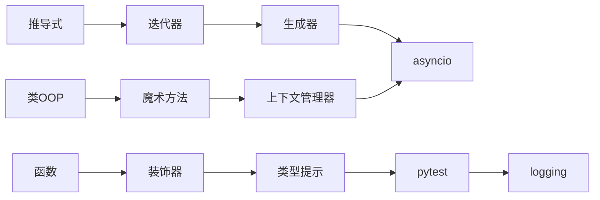

# 进阶层｜语法与工程｜学习总览

<参考资料>

- https://docs.python.org/3/howto/functional.html
- https://docs.python.org/3/library/functools.html
- https://docs.python.org/3/library/itertools.html
- https://docs.python.org/3/library/contextlib.html
- https://docs.python.org/3/library/typing.html
- https://docs.python.org/3/library/asyncio.html
- https://docs.pytest.org/en/stable/
- https://docs.python.org/3/library/logging.html

</参考资料>

## 本地知识库索引（模块级）

- `obsidian-vault/LLM_Learning/wiki/topics/python-advanced-to-ai-roadmap.md`
- `obsidian-vault/LLM_Learning/wiki/concepts/list-comprehension.md`
- `obsidian-vault/LLM_Learning/wiki/concepts/iterators-and-generators.md`
- `obsidian-vault/LLM_Learning/wiki/concepts/classes-and-oop.md`
- `obsidian-vault/LLM_Learning/wiki/concepts/decorators.md`
- `obsidian-vault/LLM_Learning/wiki/concepts/context-managers.md`
- `obsidian-vault/LLM_Learning/wiki/concepts/asyncio-in-practice.md`
- `obsidian-vault/LLM_Learning/wiki/concepts/standard-library.md`
- `obsidian-vault/LLM_Learning/raw/Python进阶到AI应用_完整学习地图.md`（D~F 章节）

## 定义（精要）

**进阶层**：把 Python 的「语言进阶语法」与「工程化基础工具」打通——以装饰器 / 上下文 / 生成器 / 类型 / 异步 等覆盖 80% 进阶场景，并以 `pytest`、`logging` 建立**可测试 + 可观测**的基础工程能力，为后续数据/API/AI 层提供可靠组件。

## 通俗比喻

如果基础层是「钢筋水泥」，进阶层是**预制构件**：装饰器是「外挂模块」、上下文管理器是「水电闸」、生成器是「流水线传送带」、类型提示是「构件规格说明」、`pytest`/`logging` 是「质检台 + 监控摄像头」。

## 子知识点（顺序 = 文件夹序号）

| 序号 | 目录 | 核心 |
|------|------|------|
| 01 | `01_推导式` | 列表/字典/集合推导、生成器表达式；何时退回 for |
| 02 | `02_迭代器与生成器` | `__iter__`/`__next__`、`yield`、惰性流式 |
| 03 | `03_类与面向对象` | 类/实例变量、`super()`、MRO、duck typing |
| 04 | `04_装饰器` | 函数/类装饰器、带参装饰器、`functools.wraps` |
| 05 | `05_上下文管理器` | `with`、`__enter__/__exit__`、`@contextmanager`、`async with` |
| 06 | `06_魔术方法` | `__str__`/`__repr__`/`__call__`/`__eq__`/`__hash__`/容器协议 |
| 07 | `07_类型提示` | `typing` 全家桶、`mypy`/`pyright`、`Protocol/TypedDict` |
| 08 | `08_asyncio异步` | `async/await`、事件循环、`gather/wait_for`、`async with` |
| 09 | `09_pytest测试` | fixture、参数化、mock、覆盖率 |
| 10 | `10_logging日志` | 层级 logger、handler/formatter、结构化日志 |

## 知识图谱

## 学习顺序与节奏建议

01～03 是「数据/对象基础」，04～06 是「语言魔法层」，07～08 是「类型 + 异步」，09～10 是「工程闭环」。建议以 2～3 周完成；每节坚持 `note → practice → 费曼`。

## 闭环

各节 `*_note.md` → 子目录拆分 `*.py` 练习自测 → 「我讲【XX】，你当小白连续提问」直至讲清。

## 参考文献（MCP）

- 函数式 HOWTO：https://docs.python.org/3/howto/functional.html
- functools：https://docs.python.org/3/library/functools.html
- itertools：https://docs.python.org/3/library/itertools.html
- contextlib：https://docs.python.org/3/library/contextlib.html
- typing：https://docs.python.org/3/library/typing.html
- asyncio：https://docs.python.org/3/library/asyncio.html
- pytest：https://docs.pytest.org/en/stable/
- logging：https://docs.python.org/3/library/logging.html
