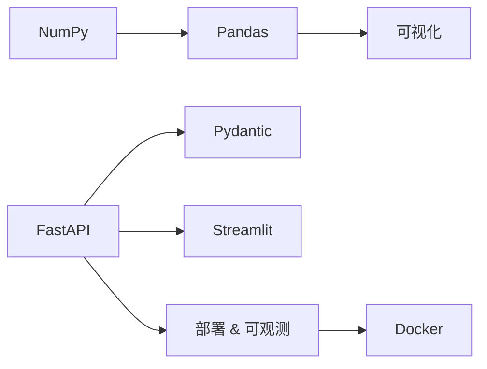

# 接轨层｜数据与API｜学习总览

<参考资料>

- https://numpy.org/doc/stable/user/index.html
- https://pandas.pydata.org/docs/user_guide/index.html
- https://matplotlib.org/stable/tutorials/index.html
- https://seaborn.pydata.org/tutorial.html
- https://fastapi.tiangolo.com/zh/
- https://docs.pydantic.dev/latest/
- https://docs.streamlit.io/
- https://docs.docker.com/get-started/

</参考资料>

## 本地知识库索引（模块级）

- `obsidian-vault/LLM_Learning/wiki/topics/numpy-numerical-foundations.md`
- `obsidian-vault/LLM_Learning/wiki/topics/fastapi-api-engineering.md`
- `obsidian-vault/LLM_Learning/wiki/concepts/broadcasting-rules.md`
- `obsidian-vault/LLM_Learning/wiki/concepts/view-vs-copy.md`
- `obsidian-vault/LLM_Learning/wiki/concepts/dtype-and-memory.md`
- `obsidian-vault/LLM_Learning/wiki/concepts/dependency-injection.md`
- `obsidian-vault/LLM_Learning/wiki/concepts/api-security.md`
- `obsidian-vault/LLM_Learning/wiki/concepts/deployment-strategy.md`
- `obsidian-vault/LLM_Learning/wiki/entities/numpy.md`
- `obsidian-vault/LLM_Learning/wiki/entities/fastapi.md`

## 定义（精要）

**接轨层**：把 Python 进阶能力对接到 AI 工程化所需的**数据处理三板斧（NumPy / Pandas / 可视化）**与**API + 部署套件（FastAPI + Pydantic + Streamlit + 部署可观测）**，让模型/RAG 服务能被前端、其他服务和外部系统正确调用。

## 通俗比喻

数据三板斧像「中央厨房」：NumPy 是切菜机（向量化）、Pandas 是中式厨房（表格清洗）、Matplotlib/Seaborn 是出餐摆盘；FastAPI + Pydantic 是「外卖打包窗口」（按合同打包）；Streamlit 是「试吃台」；部署与可观测是「外卖配送 + 厨房监控」。

## 子知识点（顺序 = 文件夹序号）

| 序号 | 目录 | 核心 |
|------|------|------|
| 01 | `01_numpy向量化与广播` | ndarray、向量化、broadcasting、view vs copy、dtype |
| 02 | `02_pandas清洗与聚合` | DataFrame、`groupby`、`merge`、缺失值与时间序列 |
| 03 | `03_matplotlib与seaborn可视化` | 子图栅格、统计图、风格主题 |
| 04 | `04_fastapi路由与模型` | 路由、Pydantic 请求体、`Depends`、异步路由 |
| 05 | `05_pydantic数据校验` | `BaseModel`、字段约束、`field_validator`、JSON Schema |
| 06 | `06_streamlit原型` | `session_state`、`@st.cache_data`、组件交互 |
| 07 | `07_部署与可观测` | Docker、反向代理、`logging`、Prometheus/Grafana |

## 知识图谱

## 学习顺序与节奏建议

01～03 数据线建议 1 周；04～06 服务线建议 1 周；07 部署可独立 2～3 天；优先把 `pandas → fastapi` 闭环跑通，作为后续 RAG/Agent 的承载层。

## 闭环

各节 `*_note.md` → 拆分 `*.py` 练习自测 → 在 FastAPI 中跑一个最小可用接口 → 「费曼：广播规则 / 依赖注入」复述。

## 参考文献（MCP）

- NumPy 用户指南：https://numpy.org/doc/stable/user/index.html
- Pandas 用户指南：https://pandas.pydata.org/docs/user_guide/index.html
- Matplotlib 教程：https://matplotlib.org/stable/tutorials/index.html
- Seaborn 教程：https://seaborn.pydata.org/tutorial.html
- FastAPI 中文文档：https://fastapi.tiangolo.com/zh/
- Pydantic 文档：https://docs.pydantic.dev/latest/
- Streamlit 文档：https://docs.streamlit.io/
- Docker Get Started：https://docs.docker.com/get-started/
