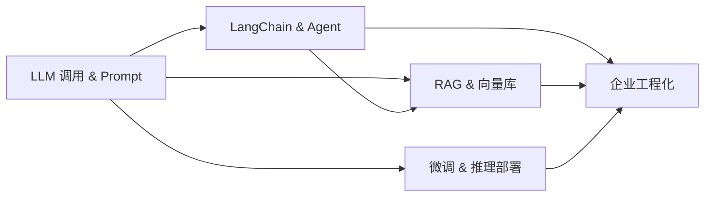

# AI 核心层｜应用工程｜学习总览

<参考资料>

- https://platform.openai.com/docs/guides/text-generation
- https://platform.openai.com/docs/guides/function-calling
- https://python.langchain.com/docs/get_started/introduction
- https://docs.llamaindex.ai/en/stable/
- https://docs.trychroma.com/
- https://qdrant.tech/documentation/
- https://docs.vllm.ai/en/latest/
- https://github.com/ollama/ollama
- https://huggingface.co/docs/peft/index

</参考资料>

## 本地知识库索引（模块级）

- `obsidian-vault/LLM_Learning/wiki/topics/python-advanced-to-ai-roadmap.md`
- `obsidian-vault/LLM_Learning/wiki/topics/enterprise-llm-engineering-roadmap.md`
- `obsidian-vault/LLM_Learning/raw/Python进阶到AI应用_完整学习地图.md`（J~N 章节）
- `obsidian-vault/LLM_Learning/raw/学习地图.md`
- `obsidian-vault/LLM_Learning/wiki/concepts/asyncio-in-practice.md`
- `obsidian-vault/LLM_Learning/wiki/concepts/api-security.md`
- `obsidian-vault/LLM_Learning/wiki/concepts/deployment-strategy.md`

## 定义（精要）

**AI 核心层**：以 Python 为母语，将「**LLM 调用 + 复杂应用编排（LangChain/Agent）+ 检索增强（RAG）+ 微调与推理部署 + 企业级工程化**」组合成可投产的智能应用栈；产出形态从「能跑通的 Demo」过渡到「能上线、可观测、可治理」的服务。

## 通俗比喻

如果接轨层是「外卖窗口」，AI 核心层是**整条智能餐厅产业链**：LLM 是大厨，Prompt 是菜单，Function Calling 是「点菜单 → 取餐」机器人，LangChain 是中央厨房，RAG 是冷库 + 食材索引，微调是「私房菜培训」，企业工程化是 ISO 体系与监控。

## 子知识点（顺序 = 文件夹序号）

| 序号 | 目录 | 核心 |
|------|------|------|
| 01 | `01_LLM调用与Prompt` | OpenAI 兼容 API、流式、Function Calling、Prompt 工程 |
| 02 | `02_LangChain与Agent` | LCEL、Chains、Tools、ReAct/Plan-Execute、LangGraph |
| 03 | `03_RAG与向量库` | 文档加载、切分、Embedding、Chroma/Qdrant、Hybrid Search、重排 |
| 04 | `04_微调与推理部署` | LoRA/QLoRA、SFT/DPO、vLLM/Ollama/TGI 部署 |
| 05 | `05_企业工程化落地` | Docker、CI/CD、Loguru/Prometheus/Grafana、JWT、token 计费 |

## 知识图谱

## 学习顺序与节奏建议

J → L → K → M → N。先把「LLM 调用 + RAG」闭环跑通能产出业务可用 demo；再补 Agent 与微调；最后做工程化。整体建议 4～6 周。

## 闭环

各节 `*_note.md`（含本阶段 stub）→ 子目录练习占位脚本（先以最小可跑通示例为准）→ 把 demo 接进 `practical/` 中的实战项目；并在仓库根 `obsidian-vault/.../qa-records.md` 留痕。

## 待写清单（本阶段需补的概念页）

> 主 Vault 当前缺以下条目，可在学习中边落盘边补：
>
> - `concepts/prompt-engineering.md`
> - `concepts/function-calling.md`
> - `concepts/langchain-lcel.md`
> - `concepts/rag-pipeline.md`
> - `concepts/embeddings-and-rerank.md`
> - `concepts/lora-and-qlora.md`
> - `concepts/vllm-deployment.md`
> - `concepts/observability-llm.md`

## 参考文献（MCP）

- OpenAI 文本生成：https://platform.openai.com/docs/guides/text-generation
- Function Calling：https://platform.openai.com/docs/guides/function-calling
- LangChain：https://python.langchain.com/docs/get_started/introduction
- LlamaIndex：https://docs.llamaindex.ai/en/stable/
- Chroma：https://docs.trychroma.com/
- Qdrant：https://qdrant.tech/documentation/
- vLLM：https://docs.vllm.ai/en/latest/
- Ollama：https://github.com/ollama/ollama
- PEFT (LoRA/QLoRA)：https://huggingface.co/docs/peft/index
